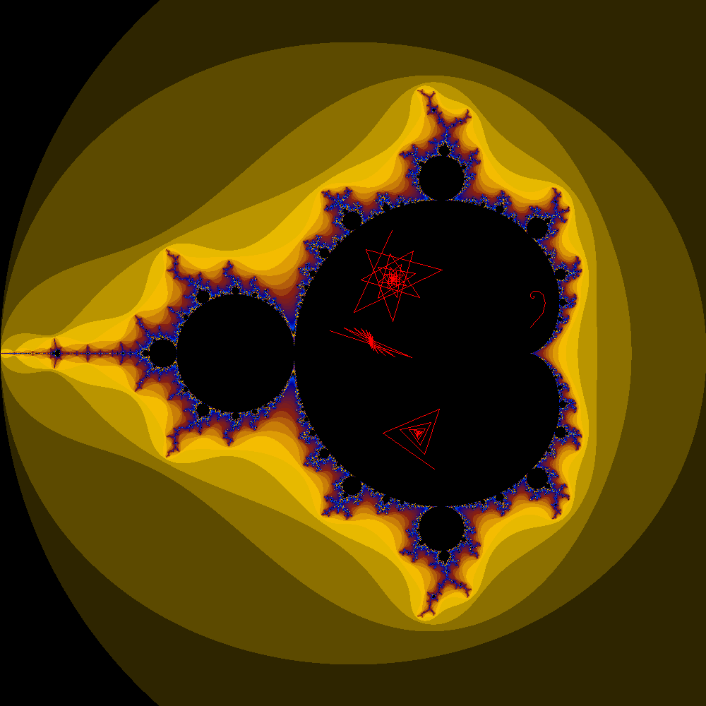

*[Mandelbrot](https://en.wikipedia.org/wiki/Mandelbrot_set) & [Julia Set](https://en.wikipedia.org/wiki/Julia_set) viewer.*
=

## Some Examples

<table>
  <tr>
    <td>
			<strong>An Electric Babybrot:</strong> 
			<em>{ Mandel , center = (-1.25126, 0.4039i) , 3125x , n = 2.00 }</em>
			
		</td>
    <td>
			<strong>A Firey Babybrot:</strong> 
			<em>{ Mandel , center = (-0.10115, 0.95542i) , 390625x , n = 2.00 }</em>
			
		</td>
  </tr>
  <tr>
    <td>
			<strong>Visualizing Orbits:</strong> 
			<em>{ Mandel , center = ( -0.50, 0.00i) , 1x , n = 2.00 }</em>
			
		</td>
    <td>
			<strong>A Mandel Archipelago</strong> 
			<em>{ Mandel , center = ( -0.9196, 0.00i) , 5x , n = 3.75 }</em>
			
		</td> 
  </tr>
	<tr>
		<td>
			<strong>An Icey Julia Set</strong> 
			<em>{ Julia , center = (0.00, 0.00i) , c = (0.358, -0.066i) , 1x , n = 2.00 }</em>
			
		</td>
		<td>
			<strong>A Vibrant Julia Set</strong> 
			<em>{ Julia , center = (-0.229, 0.741i) , c = (-0.8528, 0.0234i) , 25x , n = 10.0 }</em>
			
		</td>
	</tr>
	<tr>
		<td>
			<strong>Sprial in The "Seahorse Valley"</strong> 
			<em>{ Mandel , center = (-0.80325, 0.17804i) , 15625x, n = 2.00 }</em>
			
		</td>
		<td>
			<strong>A Crystaline Julia Set</strong> 
			<em>{ Julia , center = (1.0i, -0.10i) , c = (-0.134, 0.039i) , 3.75x , n = 4/3 }</em>
			
		</td>
	</tr>
	<tr>
		<td>
			<strong>Super High n Julia Set Spiral</strong> 
			<em>{ Julia , center = (0.69184, 0.53712i) ,   c = (-0.05732 , 0.89796i) , 25x , n = 25.0 }</em>
			
		</td>
		<td>
			<strong>A Sixth Power Babybrot</strong> 
			<em>{ Mandel , center = (0.38536, 0.27691i) , 24414000x , n = 6.00 }</em>
			
		</td>
	</tr>
</table>
